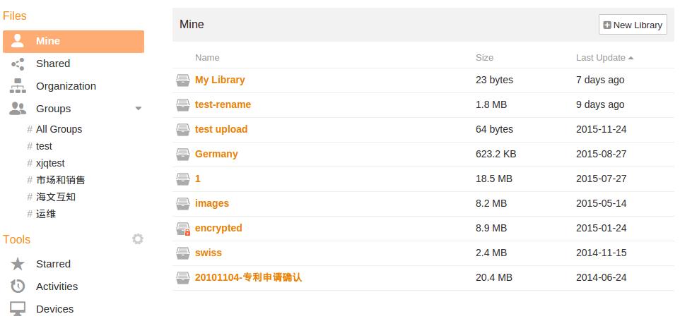
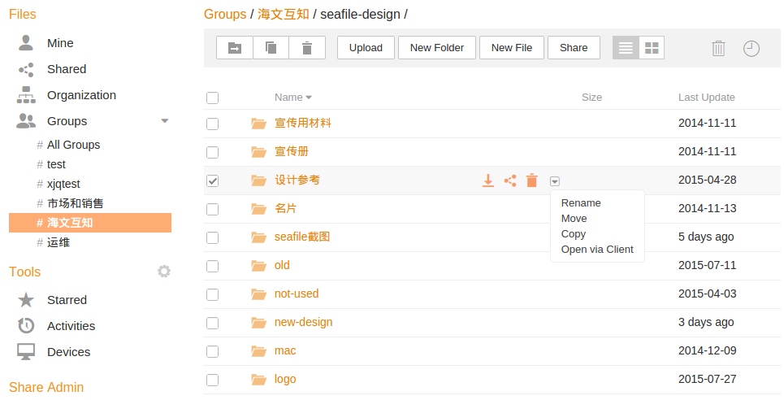

# Managing Files with Libraries

Seafile uses "libraries" to organize your files. A library is a top level container for a set of files and folders. You can create a library for each project you work on, or each document type you want to save in Seafile. A library works mostly like a top level folder. But it also has some special properties:

* Each library keeps its own file modification history. There is no global file modification history across all libraries.
* Each library can be synced to desktop clients separately. You can choose which libraries to be synced.

When you log into Seafile's web app for the first time, Seafile automatically creates a default library named "My Library" for you. You can also create more libraries. Here is what it looks like when you've created a few libraries.

You can navigate into a library and manage your files and folders. You can upload, download, rename, move, copy and delete files.

After [syncing a library with desktop client](../syncing_client/install_sync.md), you can do any file operations inside the local library folder. The operations will be uploaded to the server.