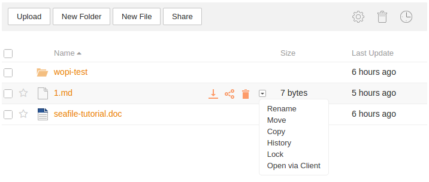
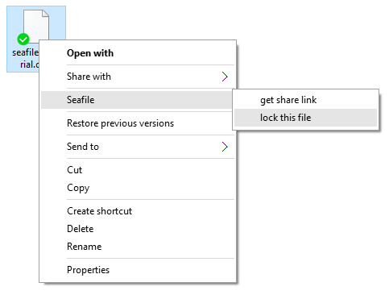
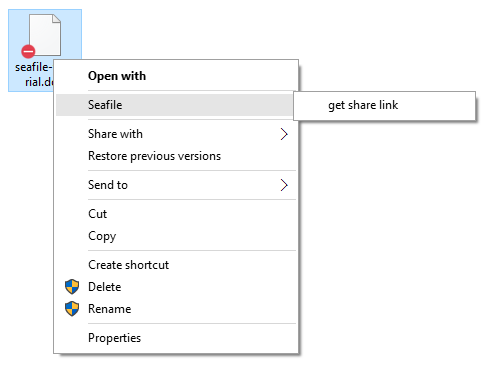

# File Locking

When more than one person collaborate on a file, it's likely that more than one person modify the file at about the same time. Seafile handles this situation nicely with conflict files. But it's often more convenient to lock the file when one person wants to exclusively modify the file. Seafile Professional Edition supports file locking.

File locking works on both the web app and the desktop syncing client. We'll introduce them one by one.

## File Locking on the Web App

To lock a file, you can navigate into the file's folder on the web app, and click on the "operations" drop-down menu.

After the file is locked, you can see a red "stop sign" at the corner of the file icon. Moving the mouse on the stop sign, you can see who locks the file. And you can also unlock a file that's locked by you. But you cannot unlock files locked by others.

## File Locking on the Desktop Client

After a library is synced to the desktop, you can lock/unlock files in that library inside File Explorer on Windows or Finder on Mac OS.

To lock a file, just right click on a synced file and choose "lock this file" in the "Seafile" menu.

If a file is locked by you, you can see an orange "stop sign" on the file icon. You can choose to unlock it.

If a file is locked by other user, you can see a red "stop sign" on the file icon. The file is automatically set to read-only. You cannot modify it until it's unlocked.

If a library is not synced, you can still use cloud file browser to lock and unlock files in it.

## Auto Locking Office Files

After a library is synced to the desktop, when you open a Microsoft Office file inside the library, Seafile automatically locks the file. When you close the file, Seafile automatically unlocks the file. The locking state is propagated to other computers syncing this library. It prevents concurrent editing the same Office file and is convenient for collaboration.

## Details about File Locking

There are a few useful tips about how file locking works:

* A locked file can only be unlocked by the user who locked it.
* A locked file cannot be modified, moved, renamed or deleted by other users. But other users can still move, delete or rename the parent folder of a locked file. The purpose of file locking is mainly to prevent concurrent editing.
* When a locked file's parent folder is renamed or moved inside the same library, it remains locked after the operation.
