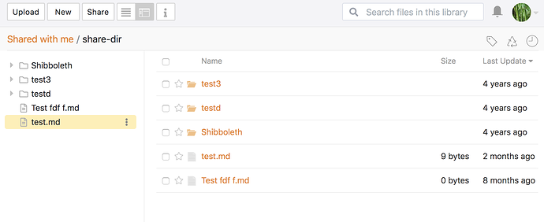
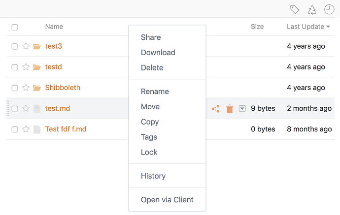
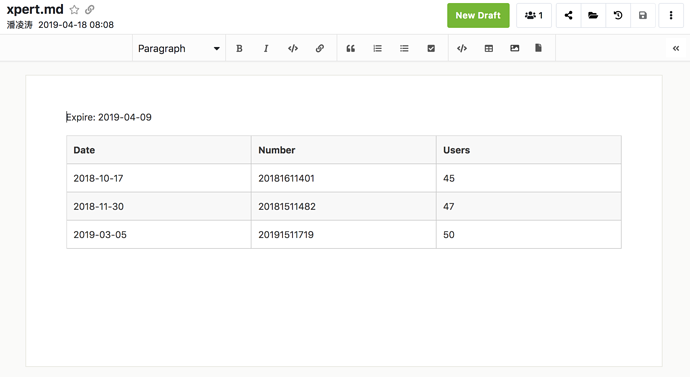
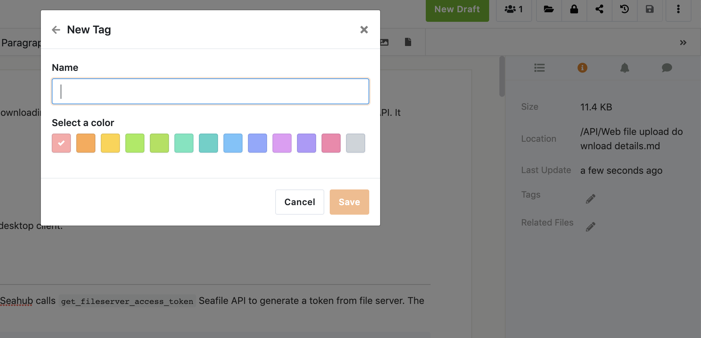
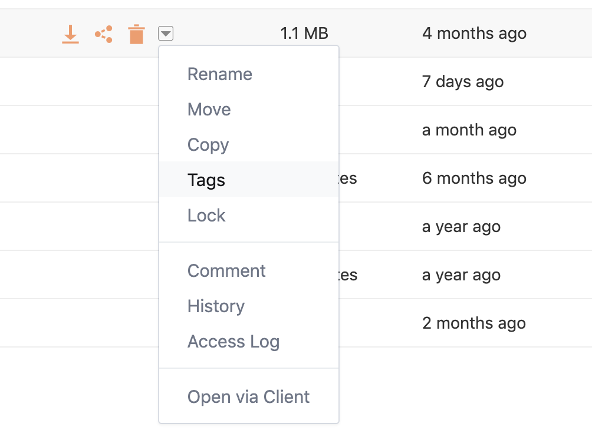
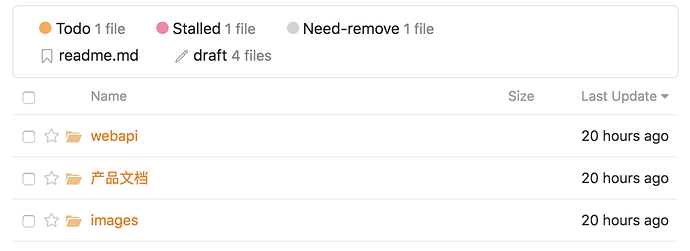
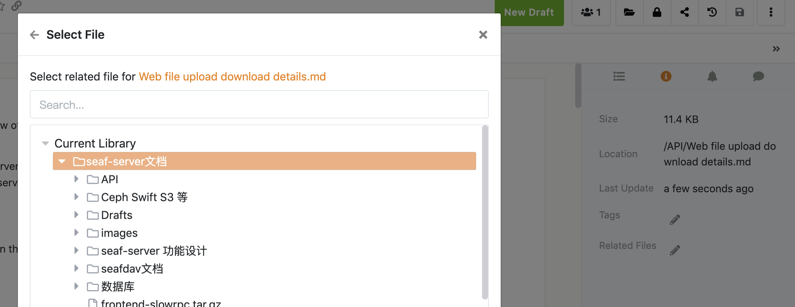

# Managing a Library as Wiki

Capturing and storing little structured data in an easy-to-use fashion – that is what Seafile’s wikis are for. Wiki pages are written in Markdown (MD), a simple markup language, to ensure cross platform compatibility. MD files store textual, tabular as well as graphical information; You can also add links to other documents in a Markdown file.

You can manage a standard library in Seafile like a Wiki, with the "Column View" introduced in 7.0 version. Since Seafile implements wikis as standard Seafile libraries, they can be synced and shared with other users just like any ordinary library.

## Column View

Wikis usually have a side bar containing a tree-like folder structure, to enable quick-and-easy browsing of Wiki pages. Seafile's Column View allows you to manage the files in a library in the same way as a Wiki space. Users can browse in it and move files and folders just by dragging and dropping. File actions such as renaming, moving, and opening via client are available in a right-click-accessible context menu.

## WYSIWYG Markdown Editor

Wiki pages in Seafile are saved as ordinary documents in Markdown format. To create a new Wiki page in a library, just create a new Markdown document. MD files can be edited straight from Seafile’s web interface with the online MD editor. The web-based editor offers a smooth user experience and rich formatting options for text, images, and tables. Images can be imported into MD files from libraries and local storage as well as by hyperlinks. Basic image editing functions such as scaling can also be performed in the editor’s what-you-see-is-what-you-get (WYSIWYG) interface. Tables can be inserted and modified with just a few clicks. The same thing goes for a table’s content: A table can be copied in its entirety or in part without leaving the WYSIWYG view.

The change history of a Markdown file can be easily accessed by clicking the "File History" button in the menu on top of the editor interface.

You can open a hidden side bar on the right side of the Markdown editor. Table of contents, file information, formatting suggestions, and collaborative commenting are provided in this side bar.

## File Tagging and Related Documents

File tagging is an important feature for knowledge management. Seafile allows users to define tags for each library and apply tags to files. Tags can be managed from the side bar of the Markdown editor, or from the file browser interface.

The file browser interface provides a summary of all file tags in the current library.

You can also add related files to a Markdown document from the "File Information" tab in the side bar.

